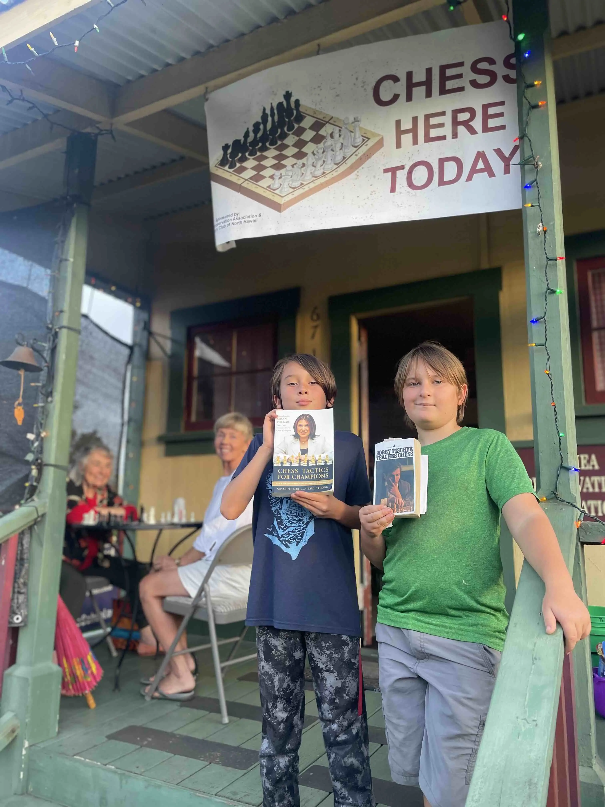
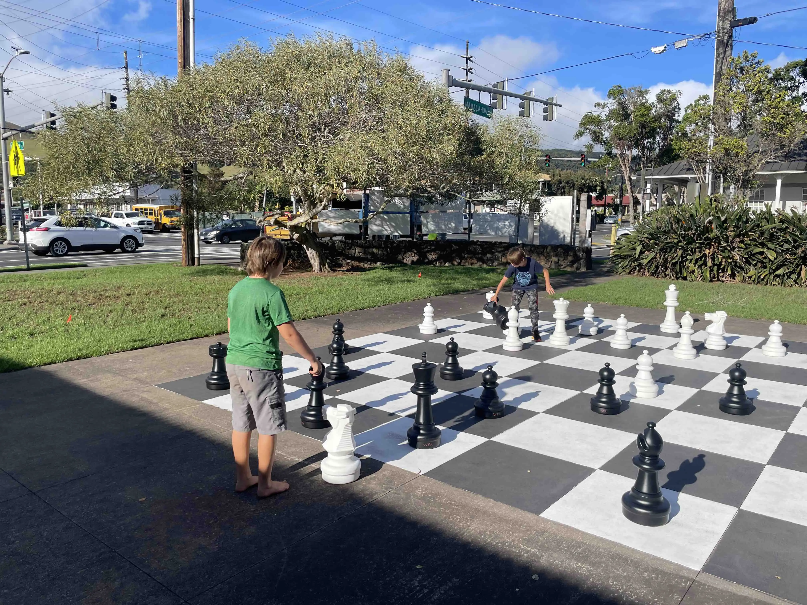
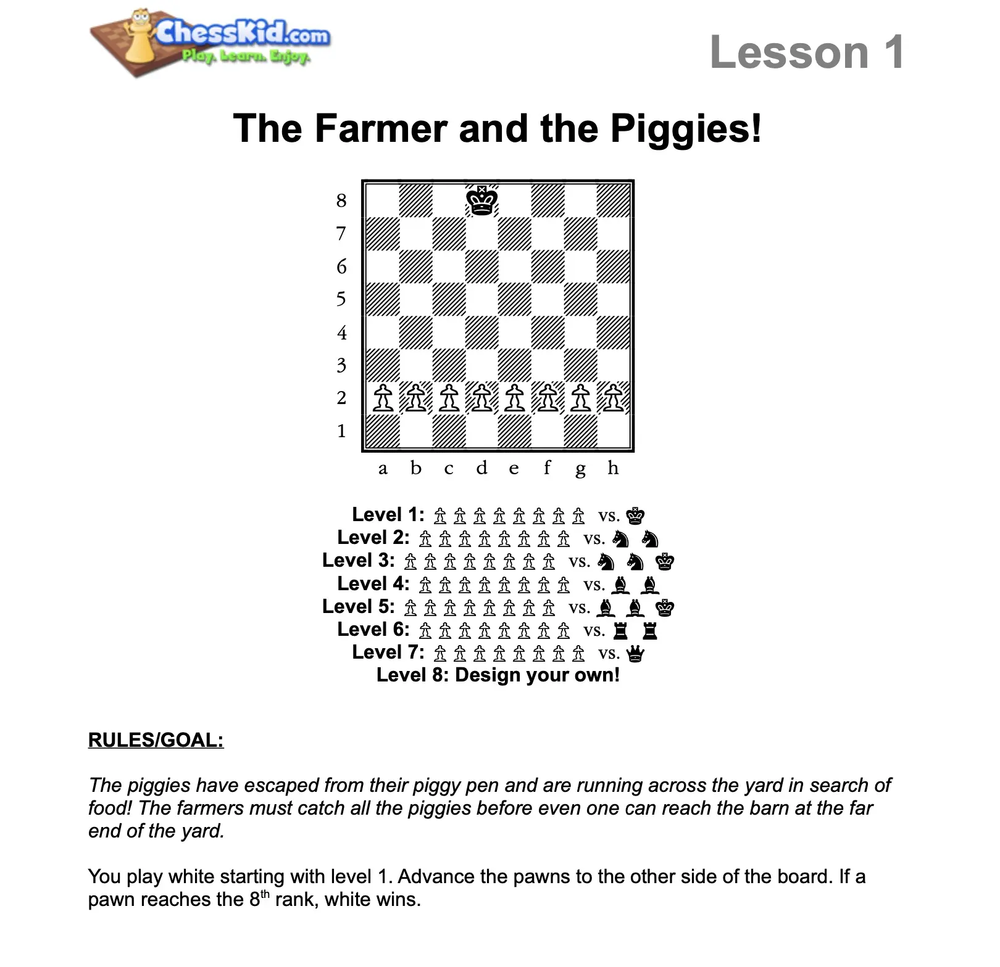

This was Waimea Chess Club's first open house! In attendance we had Eli and Jotan pictured below holding some chess books and Kris and Marianne playing their 3rd match. Uncle Pete and auntie Shelly helped open up the space and set everything up.

Eli and Jotan played one match on the huge chess board outside.

And we transitioned indoors to play a fun and challenging chess mini-game called: The Farmer and the Piggies!

And we had a special flyer to announce the open house that was created with the help of a very cool [artificial intelligence](https://openai.com/dall-e-2/). Check out the flyer:

We plan to host another open house next week. Come join us!
