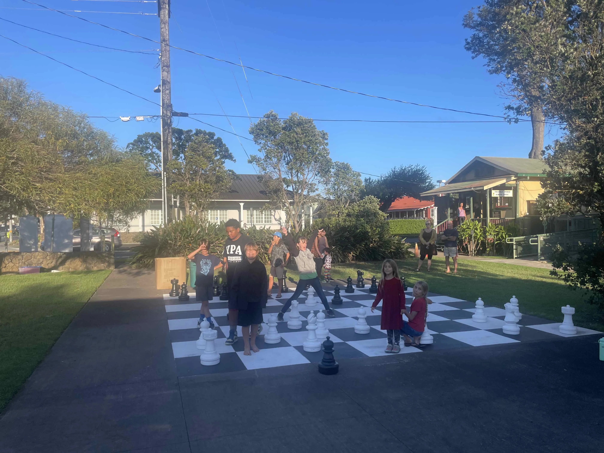

This week we gathered together and did some chess puzzles. The puzzles were provided by a [chess club in the UK](https://www.delanceyukschoolschesschallenge.com/) and you can look at their [full collection here](https://www.delanceyukschoolschesschallenge.com/chess-worksheets/). Each group of kids got their own set of puzzles depending on their level. You can find them in the [resources section](/resources).

The weather being beautiful and all, everyone managed to get an outdoor game going and run around silly.

We're taking a pause of the chess club for the holidays but looking forward to getting together in the new year.

